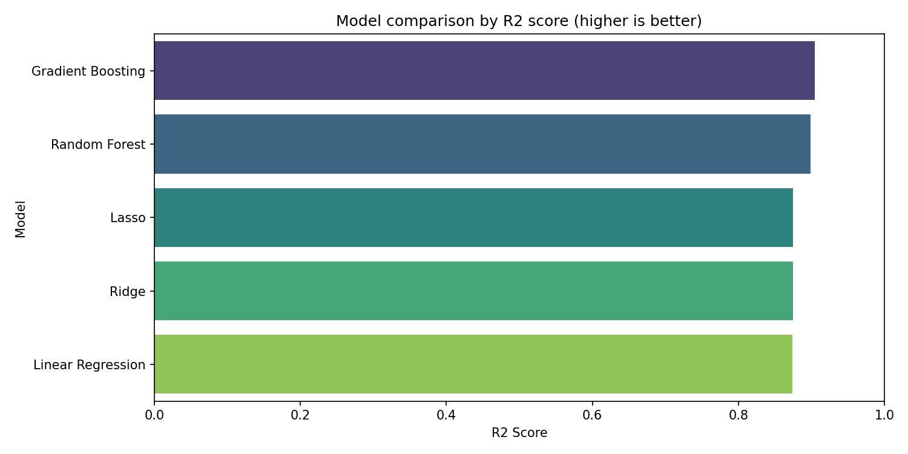
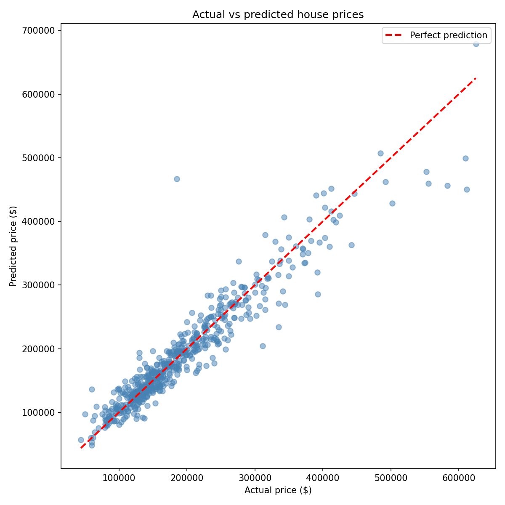
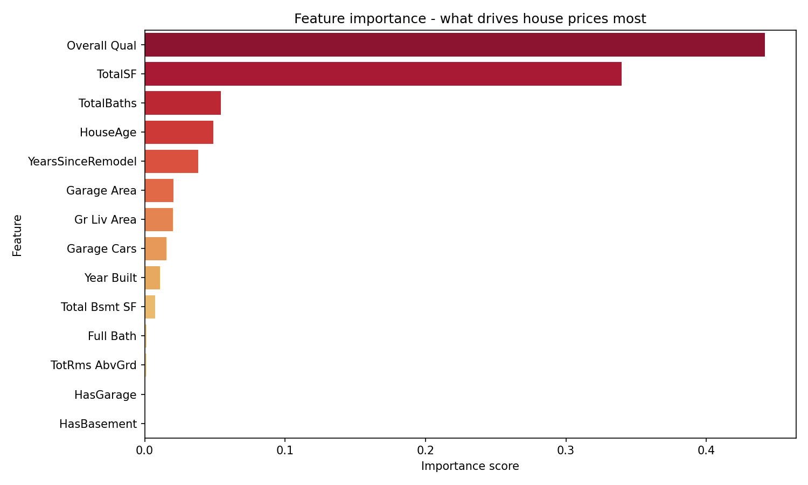
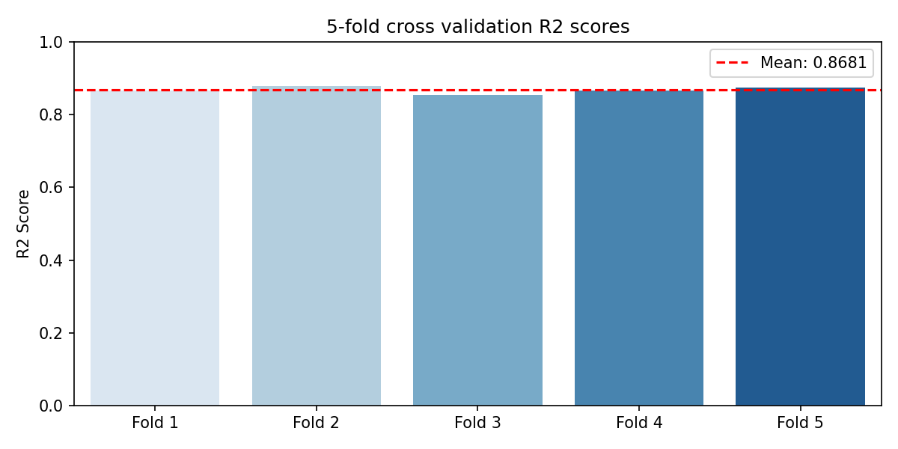

# House Price Prediction - Ames Housing Dataset

A machine learning project that predicts house sale prices using the Ames Housing dataset. Built with scikit-learn, comparing five regression models and achieving an R2 score of 0.87 using Gradient Boosting.

## Results

- **Best model:** Gradient Boosting Regressor
- **R2 Score:** 0.87 (explains 87% of price variation)
- **Mean Absolute Error:** $17,041
- **Cross validation:** 0.8681 mean R2 across 5 folds

## Key findings 

- Overall quality rating is the single strongest predictor of house price
- Total sqaure footaage (engineered feature combining all floors) outperformed any individual floor measurement
- Gradient Boosting significantly outperformed Linear Regression, confirming that hose price relationships are non-linear
- The model predicts within ~9% of actual price on average

## Visualizations






## How to run it

```bash
git clone https://github.com/jfpennington/house-price-prediction.git
cd house-price-prediction
python -m venv venv
venv\Scripts\activate
pip install -r requirements.txt
jupyter notebook
```

Then open `notebooks/03_model.ipynb` and run all cells.

## Feature engineering
Seven new features were engineered from the raw data:
- `TotalSf` - combined square footage across all floors
- `TotalBaths` - weighted total of all bathroom types
- `HouseAge` - age of house at time of sale
- `YearsSinceRemodel` - years since last renovation
- `HasPool`, `HasGarage`, `HasBasement` - binary presence indicators

## Dataset

[Ames Housing Dataset](https://www.kaggle.com/datases/prevek18/ames-housing-dataset) via Kaggle

## Tools

Python * pandas * numpy * scikit-learn * matplotlib * seaborn * Jupyter